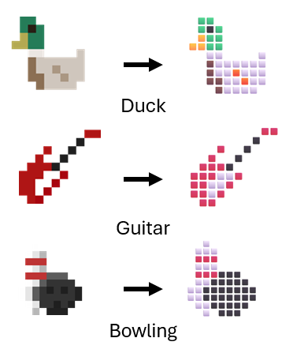

# UCSC CSE244A
## Can LLMs Parse Spatial Structure from Text? A Benchmark Using Emoji-Encoded Pixel Art.



# Usage

## Installation
```
git clone git@github.com:Lradovan/CSE244A_Project.git
cd CSE244A_Project
python3 -m venv venv
source venv/bin/activate
pip install -r requirements.txt
```


## Data

Emoji artwork used in this benchmark is derived from the SerenityOS Emoji Project and is licensed under the BSD 2-Clause License. Copyright © 2018–2023 the SerenityOS developers, Linus Groh, and Gegga Thor. The full license text is provided in `licenses/serenityos-emoji.txt.`

1. Download the serenity OS emojis from [here](https://emoji.serenityos.org/).

2. Convert the emoji images into a JSONL dataset comprised of emoji-encoded grids: 
```
python3 src/emoji_converter.py
```
3. Formulate the dataset into multiple-choice questions:
```
python3 src/mcq_dataset_creator.py
```
4. Inspect the benchmark in your browser:
```
python3 src/dataset_viewer.py
open emoji_dataset_view.html
```

The fields of the dataset include:

* `ascii_art`: the text string of ASCII art
* `emoji_art`: the text string of emoji art
* `colors`: a list of color squares used in the emoji art
* `unicode`: the unicode of the original emoji character
* `name`: the name of the emoji
* `category`: the emoji's category
* `choices`: the candidate answers
* `labels`: the label for each choice (0 or 1)
 
## Evaluation

To evaluate a model:
```
export API_KEY=xxx
python3 src/evaluation_by_api.py --api_key $API_KEY --model_name xxx --output_file_path xxx.json --mode text
```
